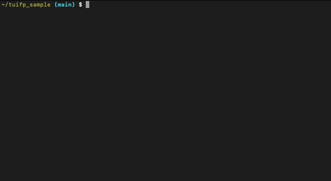

# golang TUI (Terminal User Interface) File Picker 

Simple file picker through Terminal User Interface.



### Install

```
go get github.com/fetaro/tuifp
```

### Sample

```golang
package main

import (
	"fmt"
	"github.com/fetaro/tuifp"
	"os"
)

func main() {
	// get current directory
	dir, err := os.Getwd()
	if err != nil {
		panic(err)
	}
	// Show TUI(Terminal User Interface)
	fp := tuifp.NewTuiFilePicker()
	s, err := fp.Pick(dir)
	if err != nil {
		panic(err)
	}

	fmt.Printf("picked file path = %s\n", s)
}
```
